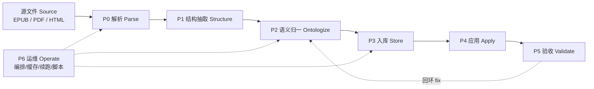
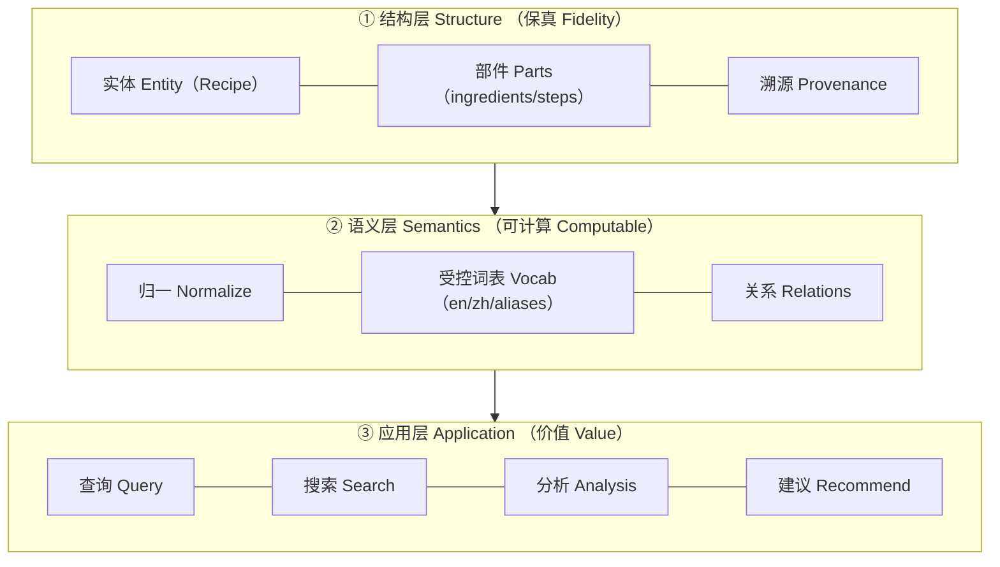
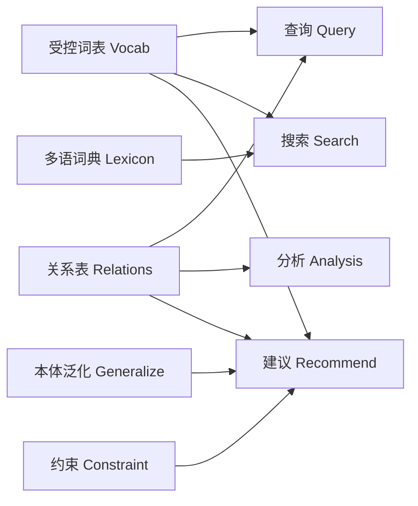

# 应用型书籍 → 本体驱动系统 · 工作流与方法论 / Applied-Book → Ontology-Driven Systems: Workflow & Methodology

> 源自我在 `cuisine_lab`（The Food Lab EPUB → 本体 → 查询/搜索/分析/建议）项目中的实操经验，
> 抽象为一套可复用到**任何应用型书籍**（菜谱、维修手册、法规、教材、机型手册…）的通用方法。
> Generalized from the `cuisine_lab` build; applies to any applied/instructional book.

---

## 0. 适用对象与目标 / Scope & goal

- **输入 / Input**：应用型书籍（讲"怎么做/是什么/怎么用"的实操内容），通常是 EPUB/PDF/HTML。
- **输出 / Output**：一套**可计算知识系统**，具备四种能力：
  | 能力 Capability | 含义 | 例子 |
  |---|---|---|
  | 查询 Query | 精确结构化取数 | 「用铸铁煎锅的菜」 |
  | 搜索 Search | 模糊/多字段/多语言 | 中文「番茄」→ 含 tomato 的菜 |
  | 分析 Analysis | 聚合/统计/共现 | 设备使用频次、工艺分布 |
  | 建议 Recommend | 基于本体推理给出行动 | 替代食材、配菜、执行顺序 |

- **一句话 / One-liner**：把"文本"变成"实体 + 关系 + 受控词表"，四类能力都从这套结构长出来。
  Turn text into entities + relations + controlled vocabulary; all four capabilities grow from it.

---

## 架构图 / Architecture （Mermaid）

**① 六阶段工作流 / Workflow**



**② 三层分离 / Three layers**（结构保真 → 语义可计算 → 应用价值）



**③ 四能力 ← 本体要素 / Capabilities ← Ontology**



**④ 建议系统 / Recommendation pipeline**


> 源文件 / source: [`workflow.mmd`](workflow.mmd)

---

## 1. 核心思想 / Core idea （本体论 Ontology）

**三层分离 / Three layers**

```
① 结构层 Structure : 忠于原文的对象化（菜谱=对象，食材/步骤=部件）   —— 保真 fidelity
② 语义层 Semantics : 归一 + 词表 + 关系（sear = 煎封上色 = pan-searing）—— 可计算 computable
③ 应用层 Application: 查询 / 搜索 / 分析 / 建议                          —— 价值 value
```

- **本体 = 实体类 + 关系 + 属性 + 受控词表**。最小可用本体不需要 OWL 全家桶：
  *类/表 + 关系表 + 别名归一词表 + 溯源* 就能支撑四类能力。
- **枢纽是"归一" / Normalization is the pivot**：把自由文本（"pan-searing"、"去焦底回锅"）
  收敛到规范 id（`sear`）。没有归一，查询/分析/建议都会因同义异形而失真。
- **双语/多语是检索与体验的一等公民**：源语言 + 用户语言并列（本项目：英 + 中）。

---

## 2. 六阶段工作流 / The 6-stage workflow

```
P0 解析 Parse → P1 结构抽取 Structure → P2 语义归一 Ontologize
        → P3 入库 Store → P4 应用 Apply → P5 验收 Validate →（回环 P2/P4）
```

| 阶段 | 输入 → 输出 | 方法 | 本项目实例 |
|---|---|---|---|
| **P0 解析** | 原始文件 → 规范文本(如 Markdown) | **结构优先**：EPUB/HTML 直接解析；扫描件才 OCR | `epub_parse.py`：XHTML→`The_Food_Lab.md` |
| **P1 结构抽取** | 规范文本 → 领域对象 JSON | 用源的标记（class/锚点/标题层级）**确定性**抽对象 | `recipes.json`：285 菜谱(食材/步骤/份量) |
| **P2 语义归一** | 对象 JSON → 归一三元组 | 受控词表 + LLM 抽开放字段 + 别名映射 | `taxonomy.py`(95 工艺/68 设备)、`llm_extract.py` |
| **P3 入库** | 三元组 → 数据库 | 实体表 + 关系表 + 受控词表 + 溯源 + 状态表 | `db.py`(SQLite) |
| **P4 应用** | 数据库 → 能力 | 查询/搜索/分析/建议（见 §4） | `webapp.py`、`food_lexicon.py` |
| **P5 验收** | 系统 → 度量 | 覆盖率 + 抽检 + 可溯源 | `stats/facets`、抽检 |
| **P6 运维** | — | 编排 + 断点续跑 + 一键脚本 + 成本档位 | `sematic`、`scripts/*.sh` |

### P0 解析 / Parse
- **决策**：源是否结构化？→ 是则**规则解析**（快、零幻觉、可复现）；仅扫描件才上 OCR/版面模型。
- 保真：产出一份**人类可读**的全文（Markdown），既是数据源也是审计底稿。
- 坑：编码（XHTML 带 XML 声明 → `lxml` 传 bytes）；层叠样式 class 才是语义信号。

### P1 结构抽取 / Structure
- 先定义**领域对象模型**：这本书的"实体"是什么、由哪些部件组成、有哪些属性。
  （菜谱：`Recipe{title, yield, ingredients[], steps[], notes[]}`；手册：`Procedure{steps[], tools[], safety[]}`）
- 用源的**原生结构**确定边界：标题层级、锚点 id、语义 class —— 比任何模型都准。
- 输出**结构化 JSON**，与"全文 Markdown"并行（一个给人看，一个给机器算）。
- 坑：无标记的隐含结构（如"没有编号、写成一段"的做法）→ 需要**启发式兜底规则**并把风险限定在小范围。

### P2 语义归一 / Ontologize（价值最高的一步）
- **双轨抽取 / Dual-track**：
  - **规则/词典**：封闭域（工艺动词、设备、单位）先建**受控词表**，确定性归一。
  - **LLM**：开放域（从步骤文本抽"用了什么、做了什么、参数多少"），产出后**必须过归一 + 校验**。
- **归一函数**：别名索引 + **最长子串匹配**（`cast-iron skillet` 先于 `skillet`）。
- **词表要带多语**：`{id, en, zh, aliases[]}`，一次建模服务检索、展示、反查。
- **参数即数据**：温度/时间/重量抽成 `(kind, value, unit)`，用于分析与校验（合理性区间）。
- 坑：LLM 会造词 → 未命中归一的保留 `slug`，并**可增量扩充词表后重跑**。

### P3 入库 / Store
- **存储选型看查询模式**：
  - 关系型(SQLite/Postgres)：过滤/聚合/反查直白 → **默认首选**（本项目）。
  - RDF/图：多层推理、跨本体对齐、SPARQL → 需要复杂语义查询时。
  - 二者可并存：RDF 做正式本体 + 关系型做查询副本。
- **最小可用 schema / Minimal schema**：
  ```
  实体表(entity)  ── 领域对象（recipes）
  部件表(parts)   ── 组成（ingredients/steps，带 ord 保序）
  受控词表(vocab) ── processes / equipment（id, en, zh）
  关系表(relations)── recipe↔equipment、step↔process、step↔param
  溯源表(provenance)── 每条断言回指原书位置
  状态表(status)  ── extraction/translation：幂等 + 断点续跑
  ```
- **保序**：原始顺序用 `ord` 显式存储，别依赖插入序。

### P4 应用 / Apply → 见 §4

### P5 验收 / Validate
- **结构覆盖率**：应得对象数 vs 实得（本项目：无步骤菜谱 23→3）。
- **语义覆盖率**：归一命中率、未归一残余（可量化"词表缺口"）。
- **可溯源率**：每个断言能回到原书位置。
- **抽检**：对高风险字段（数字/参数/温度）人工比对。

### P6 运维 / Operate
- **编排**：把每阶段封成一个 step（本项目 sematic），获得**缓存 / 血缘 / 断点续跑**。
- **幂等 + 续跑**：长任务（LLM 逐条）必须能从断点继续；`--force` 才全量。
- **成本档位**：按任务难度选模型（本项目 `deepseek-flash` 抽取/翻译比 `v4-pro` 快 ~3×）；
  缓存 + 批量 + 并发上限。
- **一键脚本 + Runbook**：`scripts/{start,status,stop,restart}` + 文档记录"实测的坑"。

---

## 3. 方法论 / Methodology

### 3.1 七条原则 / Principles
1. **结构优先于模型 / Structure over models**：能用源结构/规则解决的，绝不先上 LLM。
2. **归一即价值 / Normalization is the pivot**：受控词表是查询/分析/建议的地基。
3. **保真与语义分层 / Separate fidelity and semantics**：原文保真一份，归一一份，互不污染。
4. **一切可溯源 / Provenance everywhere**：断言必须能回到原书。
5. **双轨 + 校验 / Dual-track + validate**：规则打底、LLM 补开放域，LLM 输出必过 schema/区间校验。
6. **幂等 + 续跑 / Idempotent & resumable**：长任务默认跳过已完成。
7. **应用驱动建模 / Model for the question**：先写清"要回答哪些问题"，再定 schema。

### 3.2 关键决策点 / Decision tree
| 问题 | 选择 |
|---|---|
| 源是否结构化？ | 结构化→规则解析；扫描→OCR+版面模型 |
| 抽取方式？ | 规则+受控词表(封闭域) + LLM(开放域) 的**混合** |
| 存储？ | 过滤/聚合为主→关系型；多层推理/对齐→RDF/图 |
| 归一策略？ | 封闭词表 + 别名映射 + 最长匹配；保留未命中 slug |
| 多语？ | 词表带 `en/zh`；内容做"原文+译文"对照 |
| 编排？ | sematic/Prefect/make —— 依赖缓存与续跑需求 |
| 验收？ | 覆盖率 + 抽检 + 可溯源，量化"词表缺口" |

### 3.3 可复用模式 / Reusable patterns
- **双列联 schema**：实体–部件–受控表–关系–溯源–状态（§P3）。
- **别名归一段数**：`normalize(text) = 精确命中 → 最长子串命中 → None`。
- **中文/多语检索扩展**：查询词过**多语词典**展开成源语言关键词再匹配。
- **状态表 + 跳过**：`status(recipe_id, ok)` → 续跑；`--force` 重来。
- **分层输出**：同一模型输出"机器用(结构化)"与"人看(对照文本)"两份。

### 3.4 反模式 / Anti-patterns
- ❌ 只做全文 embedding：不可解释、无法归一、难做精确查询与建议。
- ❌ 纯 LLM 抽取、无校验/无词表：幻觉进入库，查询结果不可信。
- ❌ 把"编辑排版约束"当"数据"：混入噪声。
- ❌ 一个大 step 包住全部 LLM 调用：无进度、易断、难排查。
- ❌ 归一缺失/词表不维护：同义异形，统计与建议失真。

---

## 4. 四类能力的实现 / Implementing Query·Search·Analysis·Recommend

| 能力 | 依赖的本体要素 | 实现要点 |
|---|---|---|
| **查询 Query** | 关系表 + 受控词表 | 精确过滤：`by_equipment(slug)`、`by_process(slug)`、`by_ingredient(term)` |
| **搜索 Search** | 多字段 + 多语词典 | 一次联合查询匹配 标题/部件/关系词表(中英)；查询词过词典扩展 |
| **分析 Analysis** | 关系表 + 聚合 | 频次/分布/共现：设备 Top-N、工艺分布、食材搭配 |
| **建议 Recommend** | **本体泛化 + 约束 + 打分** | 见下 |

### 建议系统的本体做法 / Ontology-driven recommendation
```
候选生成 Candidate  : 本体泛化 —— 同义(sear↔pan-sear)、上位类(食材→类别)、工艺相似
约束过滤 Constraint : 规则排除 —— 过敏/饮食禁忌/设备可得性/时间
排序打分 Ranking    : 基于匹配度/频次/相似度
解释 Explainability : 给出理由（命中的本体关系：同名工艺、同食材、同设备）
```
- **内容型**（本项目可做）：给定食材/设备 → 推荐菜；给定菜 → 推荐替代食材（同上位类）。
- **流程型**：把步骤关系构成有向图 → 拓扑排序 → 输出执行时间轴 / mise en place。
- **协同型**（可选）：叠加用户历史。

---

## 5. 验收与度量 / Validation & metrics
- 结构覆盖率（对象级）、语义归一命中率、可溯源率、查询正确性抽检、建议相关性（人工打分）。
- 数字/单位/参数走**确定性校验**（白名单 + 量纲 + 合理区间），不交给模型"猜"。

---

## 6. 复用清单 / Reusable checklist
- [ ] 源分类：结构化 or 扫描？（决定 P0 路线）
- [ ] 定义领域对象模型（实体 + 部件 + 属性）。
- [ ] 规则解析 → 结构化 JSON（+ 全文 Markdown 保真）。
- [ ] 建**受控词表**（含多语 + 别名）。
- [ ] LLM 抽开放域字段 → 归一 + schema/区间校验。
- [ ] 建最小 schema：实体/部件/词表/关系/溯源/状态。
- [ ] 实现 query / search / analysis / recommend 四类接口。
- [ ] 覆盖率 + 抽检 + 可溯源验收。
- [ ] 编排（缓存/续跑）+ 一键脚本 + Runbook。

---

## 7. 本项目映射与局限 / Mapping & limits
- 映射：`epub_parse`→P0/P1；`taxonomy`+`llm_extract`+`translate`→P2；`db`→P3；
  `webapp`+`food_lexicon`→P4；`sematic`+`scripts`→P6。
- 局限 / Limits：
  - LLM 抽取/翻译有成本与残余幻觉 → 用词表 + 校验 + 抽检控制。
  - 归一覆盖率受词表规模限制 → 持续扩充并重跑。
  - 未做真正的推理层（无 OWL/图推理）；建议目前以"本体泛化 + 规则"为主。
  - 「建议/分析」在特征维度上仍是内容型，未接入协同过滤与用户画像。
